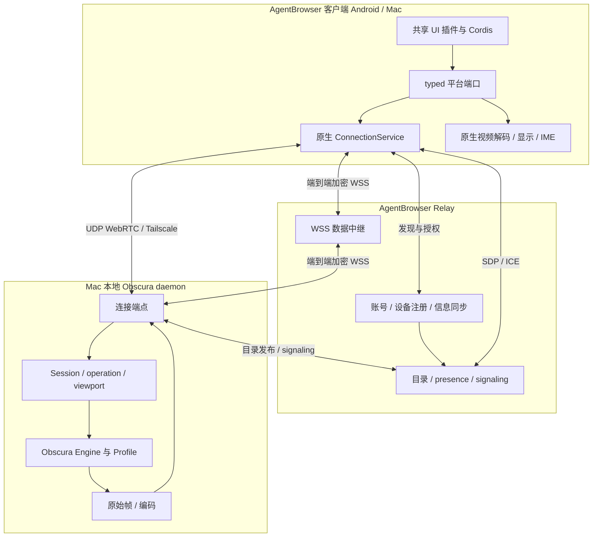

# 模块与连接架构

状态：设计决定，尚未实现。2026-09-05。产品语义与原子 operation 以 [design.md](design.md) 为唯一源，本文件拥有模块边界与连接架构；验收由 [plan.md](plan.md) 维护。

用户约束：UI 尽量使用 Cordis 插件架构；浏览器以 daemon 运行；Relay 提供账号、信息同步和 WebSocket 数据面；优先 UDP/Tailscale，之后 Relay。`rustdesktop` 暂按 RustDesk 理解，仅借鉴 rendezvous/direct/relay 模型，不承诺 RustDesk 协议兼容。

## 三个部署单元

Mac 上 Agent 通过本地 endpoint 使用同一 operation/控制权协议；本地 UI 退出不能停止 daemon。首版不另建 Agent 执行框架，适配现有调用方。插件拆分是进程内模块化，不把每个插件部署成微服务。

## 模块和路径 owner

以下是完整产品模块边界；多数仍为计划路径。AB-01/02/03/04 的本地客户端兼容性切片已实现，实际文件、调用边和验收入口见 [android-probe.md](android-probe.md)。AppSDK `android-probe` 只绑定该切片的单一 APK，不代表完整产品模块已完成。

| ID | 仓库 / 计划路径 | 唯一职责 | 禁止职责 |
| --- | --- | --- | --- |
| AB-01 ui-kernel | AgentBrowser `packages/ui-kernel/` | Cordis composition root、插件依赖与生命周期、UI slots、typed 服务注入 | 浏览器状态裁决、网络重连、视频字节搬运 |
| AB-02 ui-plugins | AgentBrowser `packages/ui-plugins/` | device-directory、browser-chrome、session-view、takeover、settings 等插件；本地交互状态 | socket/解码器/原生句柄所有权、绕过 operation 写入 |
| AB-03 client-domain | AgentBrowser `packages/client-domain/` | 远端状态只读投影、UI 命令适配、共享纯类型与 reducer | 第二个 Session owner、连接路由决策、原生对象 |
| AB-04 platform-host | AgentBrowser `apps/android/`、`apps/macos/` | OS 生命周期、WebView、IME、触控采集、安全凭据存储、原生显示资源 | 各自复制页面/接管状态机 |
| AB-05 client-connection | AgentBrowser `packages/client-connection/` | 共享 Rust 连接内核；candidate、认证、连接 generation、选路、重连和背压唯一 owner | UI active tab、DOM、浏览器业务决策 |
| AB-06 relay-service | AgentBrowser `services/relay/` | 账号、设备绑定、目录/presence、设置同步、信令、WSS 隧道 | 执行 operation、转让控制权、持久化网页 profile |
| OB-01 browser-host | Obscura `crates/obscura-host/` | 常驻服务、Session/Tab/Attachment、operation 执行仲裁、统一 viewport、profile 单写锁 | UI 生命周期、客户端选路、账号数据库 |
| OB-02 browser-engine | Obscura 现有 browser/js/dom/net/render crates | 页面执行、存储语义、输入、现有 paint 原始帧出口 | WebSocket 会话生命周期、编码/公网发现 |
| OB-03 browser-media | Obscura `crates/obscura-media/` | 共享帧消费、H.264 编码、WebRTC 发送及 WSS 编码帧输出 | 第二条 DOM 绘制链、Session 控制权 |
| OB-04 host-endpoint | Obscura `crates/obscura-host/src/endpoint/` | 本地/直连/relay 接入、对端授权、消息解码后进入 Host | 复制 operation、导航或 profile 实现 |

OB-01 的 registry/supervision 与 Engine 执行线程分离；保持 V8 的线程归属。首版先验证一个 Session/Tab worker，不在本设计承诺跨线程搬移 isolate 或多 Tab 全部可并行。一个客户端多条传输不能创建多个浏览器实例。

协议定义按领域唯一归属：Browser Session/operation/viewport ABI 放 Obscura `protocol/browser/`；账号、目录、signaling、relay tunnel ABI 放 AgentBrowser `protocol/relay/`。两边生成或使用锁定版本的绑定，不相互依赖产品运行时代码，不手工镜像协议。传输协议不得解释浏览器操作参数。

## UI 使用 Cordis 的具体边界

共享 TypeScript UI 使用 Cordis 原生 context/service/plugin/dispose 机制，先不复制 zterm 的整个 kernel 框架。React 作为共享 UI 渲染器；Android Activity + WebView 优先，Mac 使用 Tauri/Wry 壳和 native bridge。原生媒体/连接插件的构建可行性需要探针验证。

UI kernel 在 WebView JS 进程内运行；Android 原生服务、Mac Rust host、Obscura daemon 都不共享 Cordis Context。跨边界只传 typed command/event、只读投影或 stream handle。视频帧、RTP、音频、文件块和连续触控走专用通道，不经 Cordis event bus 或 JS base64。

| 插件 | 消费服务 / 提供界面 |
| --- | --- |
| account-directory | 账号与设备投影、登录/设备列表；客户端 token 仅由安全存储 owner 持有 |
| browser-chrome | 地址栏、标签栏、导航操作；远端状态取 Host 投影 |
| session-view | 挂载视频 surface、显示方向/缩放；不改变权威 buffer |
| takeover | 观察/等待接管/接管 UI，消费 Host 控制权状态 |
| input | typed input capture/IME 端口和 operation 请求；按控制代次提交 |
| settings | 画质、方向请求及设置；区分账号同步设置和设备本地偏好 |

插件是首版内置、启动时静态声明的功能模块，不做任意下载执行的插件市场。每个 capability 只有一个 provider；缺失必需插件显式启动失败。页面组件卸载只撤销其 UI 订阅，不能销毁共享连接。连接/输入必需模块不能在 operation 中途热卸载；必须先停止接收新请求并等待安全结束。不要把 Cordis 注入机制当不可信插件安全沙箱。

Android 原生生命周期 owner 决定连接是否留在前台服务以及退后台行为；共享 ConnectionService 保持物理连接真相。暂停 UI、重建 Activity 不等于 detach BrowserSession。OS 杀进程后按真实重连协议恢复，不声称连接永不中断。

## 连接策略

ConnectionService 同时维护控制、媒体、输入的 ready 状态和所选路径；账号已登录、目录已同步、socket 已打开都不代表浏览器可用。接管仍须 Host 的独立授权与确认。

自动选路分层如下。候选可在同一层有界并行探测，只有一个提交为当前输入路由；参数上限和退避值在实现探针后确定，不依赖 UI 猜测。

1. 本机 endpoint：本地 IPC/loopback，校验本机身份，无需云账号在线即可使用已授权本地入口。
2. 直连层：LAN/公网 UDP WebRTC 与已配置 Tailscale 路径优先尝试。WebRTC 使用 ICE/STUN 完成探测；Tailscale 使用其实际虚拟网卡上的可达 endpoint。优先可达、认证通过、实际数据通的候选，再比较稳定性/RTT。
3. Relay 层：直连层不可用时，使用 Relay 的显式 WSS 数据隧道。UI 显示“中继”，同时保留结构化直连失败原因。不另建隐藏旧路径。

Tailscale 是 overlay 网络，WebRTC/WSS 是传输，两者不是同一层枚举。RouteRecord 分别记录 network_path（local/LAN/public/tailscale/relay）、transport（IPC/WebRTC/WSS）和已验证底层可达性。Tailscale 可能走 DERP；无法查询其实际路径时标为 unknown，不能根据 100.64/10 地址断言点对点 UDP。

首版推荐媒体直连使用 WebRTC H.264；Tailscale 可承载 WebRTC，在设备栈无法提供可用 UDP candidate 时也可使用该网络上的直接 WSS。WSS 是明确支持的传输适配，不绕过能力协商或认证。TURN 可作为未来 WebRTC relay backend；本版不能把 signaling WSS 或自建 WSS 数据 relay 叫作 TURN，也不依赖未部署 TURN 才能中继。

### WSS 数据面

Relay 中继模式：客户端和 daemon 分别主动连 Relay，在授权的 tunnel 中配对。控制/输入与视频分离连接及发送队列；只使用一个大 WSS 流会被视频的 TCP 队头阻塞影响接管。所有隧道都有额度、帧大小、队列上限和清理机制；身份/授权失败显式拒绝。

视频走同一原始帧/编码 owner 输出的 H.264 access units，带必要 codec 配置、PTS、关键帧和流代次，由两端原生媒体适配器解码。不会把 H.264 WSS 数据直接传给 RTCPeerConnection，也不走 PNG 中转。WebRTC 内置解码接收与 WSS 原生解码是两个明确 backend，共享一个显示接口和输入语义。Android MediaCodec、macOS VideoToolbox 接收验证为必需探针。

视频通道使用端点间加密；Relay 只转发密文。TLS 提供链路保护，额外端到端协议使用成熟实现（具体库另行选择），绑定已登记设备密钥、会话及握手 transcript，不自造加密算法。输入/control 与视频的 tunnel 绑定同一授权，禁止跨账号/跨设备重绑。局域网和 Tailscale 也执行同样的应用授权。

重连/换路保留 BrowserSession；递增连接 generation，旧连接事件不能覆盖新连接状态。旧输入路由先 fencing，再提交新路由；在途 operation 查询原状态，不因换路重放。视频新路由请求关键帧；文档/viewport/控制代次继续来自 Host。暂停的 Session 投影只能标为缓存，不从它重建 Host 当前真相。

## Relay 的账号与同步范围

一个服务部署，内部 account/directory/signaling/tunnel 四个模块，暂不拆微服务。推荐 TypeScript 服务复用客户端 relay ABI，首版 SQLite 单实例存储；未来多实例需单独定义 presence 和 tunnel 路由所有权。

账号服务管理用户、设备密钥注册和授权撤销；目录服务管理设备在线状态与 Host 发布的 endpoint/Session 摘要。Session 摘要是带 Host incarnation/revision/TTL 的投影，最新完整快照替换旧快照，不把历史缓存合并成仍在线的会话。

同步范围：设备名称、可连接 Host、最小 Session 摘要、明确允许同步的用户设置。URL/页面标题等敏感摘要需显式选择；cookies、密码、localStorage、IndexedDB 和网页正文默认留在 Host profile，不进入账号同步。

账号服务签发短期、绑定设备/Host/用途的授权，Host 校验并按本地策略决定可观察/可控制。已连接授权使用到期及撤销机制，不能永久离线有效；云服务失联期间的撤销传播限制必须在协议中明确。本地预先配对身份走单独声明的本地授权策略，不是绕过云端拒绝的后门。登录失败、Host 离线、传输不可达分别上报。

## 参考源码与实际限制

zterm 路径 `~/code/zterm` 对应当前读取的 `/Volumes/extension/code/zterm`；HEAD `5cbb0b2b07e28b5185a5cd0d9a8fd1e382e10f33`，工作树存在他人修改，本轮完全只读。以下事实来自实际源码，不把历史计划当已交付。

- `packages/kernel/src/cordis/index.ts`：使用 `@cordisjs/core`，只提供进程内 lifecycle/service/plugin/event，明确排除数据流。
- `packages/kernel/package.json`：该评估模块依赖 `@cordisjs/core` 3.18.1；不是 AgentBrowser 已选定/安装版本。
- `android/src/lib/traversal/config.ts`、`socket.ts`：显式候选、WebRTC DataChannel、attempt/generation 和胜出候选处理可参考。
- `android/native/android/app/src/main/java/com/zterm/android/AndroidConnectionService.java`：当前 startAttempt 仍拒绝 RTC_DIRECT/RTC_RELAY；auto 构造 LAN/Tailscale/IPv6/IPv4 WebSocket，不能据此声称 Android 原生 UDP 已可复用。
- `android/src/traversal-relay/server.ts`：当前 `/ws/host`、`/ws/client`、`/ws/devices` 提供信令、目录/presence；消息 handler 转发 JSON relay-signal。AgentBrowser 的 H.264 WSS 数据中继是新增契约，不能直接把该信令转发器改名。
- `android/src/server/daemon-connection-endpoint-runtime.ts`：endpoint 发布与 `packages/shared/src/connection/relay-directory.ts` 的 typed 目录契约可借鉴；不复制其中 authToken 分发或仅凭地址推断 Tailscale 的做法。
- [RustDesk Server README](https://github.com/rustdesk/rustdesk-server/blob/master/README.md)：官方明确区分 hbbs ID/Rendezvous 与 hbbr relay。本设计参考责任拆分，不假设其开源服务自动提供所需账号/同步 API。

复用的是边界、协议思路与有证据的组件能力；任何复制/引入代码前另查许可证和依赖。zterm 的 terminal/tmux 语义不搬入浏览器。
